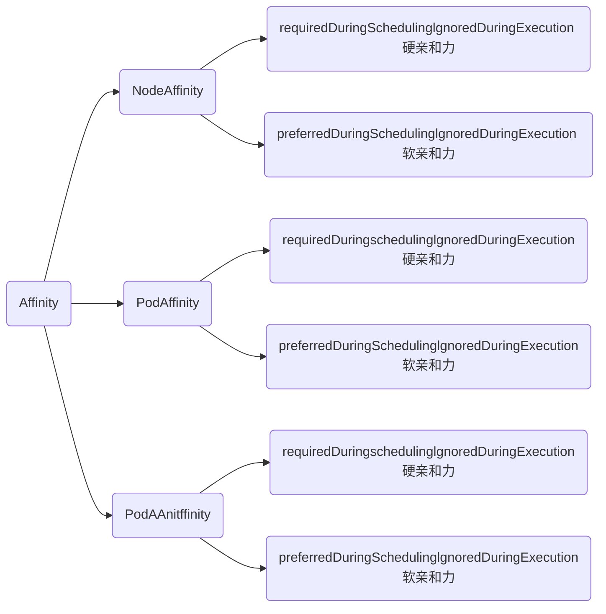

### 亲和力Affinity

- 某些Pod优先选择有ssd=true标签的节点，如果没有在考虑部署到其它节点

- 某些Pod需要部署在ssd=true和type=physical的节点上，但是优先部署在ssd=true的节点上;
- 同一个应用的Pod不同的副本或者同一个项目的应用尽量或必须不部署在同一个节点或者符合某个标签的一类节点上或者不同的区域;
- 相互依赖的两个Pod尽量或必须部署在同一个节点上。

###  Affinity分类



#### Affinity的几种场景

- 一个应用分别部署在4个node节点中，当其中一个出现问题时，其他3个可以确保高可用。
- 一个应用分别部署在两个区域，当其中一个区域出故障（光纤挖断等），另一个区域可以确保高可用。
- 尽量把同一项目不同应用部署在不同的节点上（确保宕机等影响范围降低）

#### 节点node亲和力的配置

```yaml
apiVersion: v1
kind: Pod
metadata:
  name: with-node-affinity
spec:
  affinity:    #和containers对齐
    nodeAffinity:   #节点亲和力（部署在一个节点）
      requiredDuringSchedulingIgnoredDuringExecution:  #硬亲和力配置（required，强制），与软亲和力只能存在一项。
        nodeSelectorTerms:   #节点选择器配置，可以配置多个matchExpressions（满足其一）
        - matchExpressions:   #可以配置多个key、value类型的选择器（都需要满足）
          - key: kubernetes.io/e2e-az-name
            operator: In   #标签匹配的方式(下文)
            values:   #可以配置多个（满足其一）
            - e2e-az1
            - az-2
      preferredDuringSchedulingIgnoredDuringExecution:  #软亲和力配置（preferred），与硬亲和力只能存在一项。
      - weight: 1    #软亲和力的权重，权重越高优先级越大，范围1-100
        preference:  #软亲和力配置项，和weight同级，可以配置多个，matchExpressions和硬亲和力一致
          matchExpressions:
          - key: another-node-label-key
            operator: In   #标签匹配的方式(下文)
            values:
            - another-node-label-value
  containers:
  - name: with-node-affinity
    image: nginx
```

```shell
# operator：标签匹配的方式
In：相当于key = value的形式
NotIn：相当于key != value的形式
Exists：节点存在label的key为指定的值即可，不能配置values字段
DoesNotExist：节点不存在label的key为指定的值即可，不能配置values字段
Gt：大于value指定的值
Lt：小于value指定的值
```

#### pod亲和力的配置

```yaml
apiVersion: v1
kind: Pod
metadata:
  name: with-pod-affinity
spec:
  affinity: 
    podAffinity:  #pod亲和力 
      requiredDuringSchedulingIgnoredDuringExecution: #硬亲和力
      - labelSelector:  #Pod选择器配置，可以配置多个
          matchExpressions:   #可以配置多个key、value类型的选择器（都需要满足）
          - key: security   
            operator: In    #标签匹配的方式
            values:       #可以配置多个（满足其一）
            - S1
        topologyKey: failure-domain.beta.kubernetes.io/zone   #匹配的拓扑域的key，也就是节点上label的key，key和value相同的为同一个域，可以用于标注不同的机房和地区

    podAntiAffinity:  #pod反亲和力 
      preferredDuringSchedulingIgnoredDuringExecution:  #软亲和力
      - weight: 100     #权重，权重越高优先级越大，范围1-100
        podAffinityTerm:
          labelSelector:
            matchExpressions:
            - key: security
              operator: In
              values:
              - S2
          namespaces:    #和哪个命名空间的Pod进行匹配，为空为当前命名空间 
          - default
          topologyKey: failure-domain.beta.kubernetes.io/zone
  containers:
  - name: with-pod-affinity
    image: nginx
```

#### 同一个应用部署在不同的宿主机

有5个副本，配置的是强制反亲和力，假设K8S总共有3个节点，那么会分别在3个节点启动一个pod，剩下2个会一直处于pending状态，并且pod不能和app=must-be-diff-nodes的标签部署在一起。

```yaml
apiVersion: apps/v1
kind: Deployment
metadata:
  labels:
    app: must-be-diff-nodes
  name: must-be-diff-nodes
  namespace: kube-public
spec:
  replicas: 5   #副本数
  selector:
    matchLabels:
      app: must-be-diff-nodes
  template:
    metadata:
      labels:
        app: must-be-diff-nodes
    spec:
      affinity:
        podAntiAffinity:  #反亲和力
          requiredDuringSchedulingIgnoredDuringExecution:  #强制
          - labelSelector:
              matchExpressions:
              - key: app
                operator: In
                values:
                - must-be-diff-nodes   #标签
            topologyKey: kubernetes.io/hostname 
      containers:
      - image: nginx
        imagePullPolicy: IfNotPresent
        name: must-be-diff-nodes
```

##### 同一个应用不同副本固定节点

```yaml
apiVersion: apps/v1
kind: Deployment
metadata:
  name: redis-cache
spec:
  selector:
    matchLabels:
      app: store
  replicas: 3
  template:
    metadata:
      labels:
        app: store
    spec:
      nodeSelector:
          app: store
      affinity:
        podAntiAffinity:
          requiredDuringSchedulingIgnoredDuringExecution:
          - labelSelector:
              matchExpressions:
              - key: app
                operator: In
                values:
                - store
            topologyKey: "kubernetes.io/hostname"
      containers:
      - name: redis-server
        image: redis:3.2-alpine
```


##### 应用和缓存尽量部署在同一个域内

```yaml
apiVersion: apps/v1
kind: Deployment
metadata:
  name: web-server
spec:
  selector:
    matchLabels:
      app: web-store
  replicas: 3
  template:
    metadata:
      labels:
        app: web-store
    spec:
      affinity:
        podAntiAffinity:
          requiredDuringSchedulingIgnoredDuringExecution:
          - labelSelector:
              matchExpressions:
              - key: app
                operator: In
                values:
                - web-store
            topologyKey: "kubernetes.io/hostname"  
        podAffinity:
          preferredDuringSchedulingIgnoredDuringExecution:
          - weight: 100
            podAffinityTerm:
              labelSelector:
                matchExpressions:
                - key: app
                  operator: In
                  values:
                  - store
              topologyKey: "kubernetes.io/hostname"
      containers:
      - name: web-app
        image: nginx:1.16-alpine
```

#### 尽量调度到高配置服务器

pod尽量配置到ssd=true的标签节点（软亲和，100权重），而且没有GPU=true标签的节点，也可以部署在type=physical标签的节点（权重10）

```yaml
apiVersion: apps/v1
kind: Deployment
metadata:
  labels:
    app: prefer-ssd
  name: prefer-ssd
  namespace: kube-public
spec:
  replicas: 1
  selector:
    matchLabels:
      app: prefer-ssd
  template:
    metadata:
      creationTimestamp: null
      labels:
        app: prefer-ssd
    spec:
      affinity:
        nodeAffinity:   #节点亲和力
          preferredDuringSchedulingIgnoredDuringExecution:   #软亲和力，如果需要强制部署在一个节点可以用requried
          - preference:
              matchExpressions:
              - key: ssd       #ssd标签
                operator: In   #满足
                values:
                - "true"
              - key: GPU     #GPU便标签
                operator: NotIn    #不满足
                values:
                - "true"
            weight: 100    #权重
          - preference:
              matchExpressions:
              - key: type  #type=physical标签
                operator: In
                values:
                - physical
            weight: 10    #权重
      containers:
      - env:
        - name: TZ
          value: Asia/Shanghai
        - name: LANG
          value: C.UTF-8
        image: nginx
        imagePullPolicy: IfNotPresent
        name: prefer-ssd
```

打标签

```shell
[root@ak8s-01 ~]# kubectl get node --show-labels  #查看节点标签
分别给master01,node01节点打上ssd=true的标签，master01节点单独打上GPU=true的标签
[root@ak8s-01 ~]# kubectl label node ak8s-01 ssd=true 
[root@ak8s-01 ~]# kubectl label node ak8s-01 GPU=true 
[root@ak8s-01 ~]# kubectl label node k8s-node01 GPU=true
给node02打上type=physical的标签
[root@ak8s-01 ~]# kubectl label node k8s-node02 type=physical 
```

#### 拓扑域TopologyKey

topologyKey：拓扑域，主要针对宿主机，相当于对宿主机进行区域的划分。用label进行判断，不同的key和不同的value是属于不同的拓扑域
 如下图，相同区域可以打相同的一个标签，不同区域打不一样的标签，避免同一个区出现故障，所有pod都部署在同一个区域里面导致服务无法使用。

##### 同一个应用多区域部署

根据上图逻辑上设置3个域标签，把应用pod部署在不同的的区域内
 master01,02: region=daxing
 master03,node01: region=chaoyang
 node02: region=xxx

```
[root@ak8s-01 ~]# kubectl label node ak8s-01 ak8s-02 region=daxing
[root@ak8s-01 ~]# kubectl label node k8s-node01 ak8s-03 region=chaoyang
[root@ak8s-01 ~]# kubectl label node k8s-node02  region=xxx
```

创建yaml，设置topologyKey为region，每个pod会部署在不同region上，由于设置是pod强制反亲和力，如果pod副本数超过区域上限数量，剩下的pod就会处于pending状态启动不了。

```yaml
apiVersion: apps/v1
kind: Deployment
metadata:
  labels:
    app: must-be-diff-zone
  name: must-be-diff-zone
  namespace: kube-public
spec:
  replicas: 3
  selector:
    matchLabels:
      app: must-be-diff-zone
  template:
    metadata:
      labels:
        app: must-be-diff-zone
    spec:
      affinity:
        podAntiAffinity:
          requiredDuringSchedulingIgnoredDuringExecution: #强制反亲和力
          - labelSelector:
              matchExpressions:
              - key: app
                operator: In
                values:
                - must-be-diff-zone
            topologyKey: region   #根据上图设置区域标签
      containers:
      - image: nginx
        imagePullPolicy: IfNotPresent
        name: must-be-diff-zone
```

创建并查看，发现启动的3个pod都在不同的节点上。
